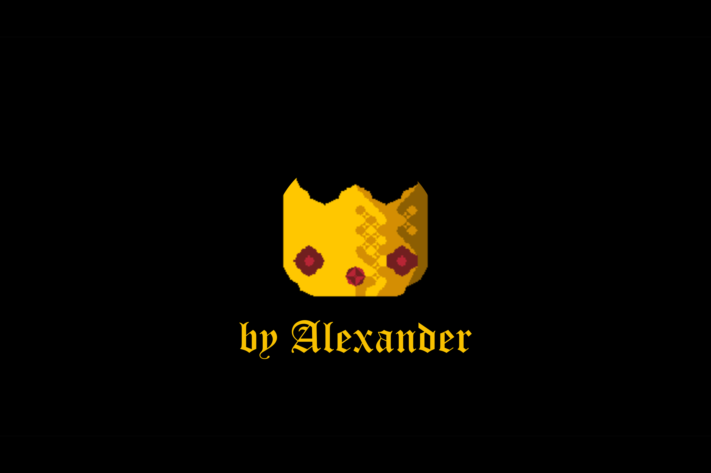
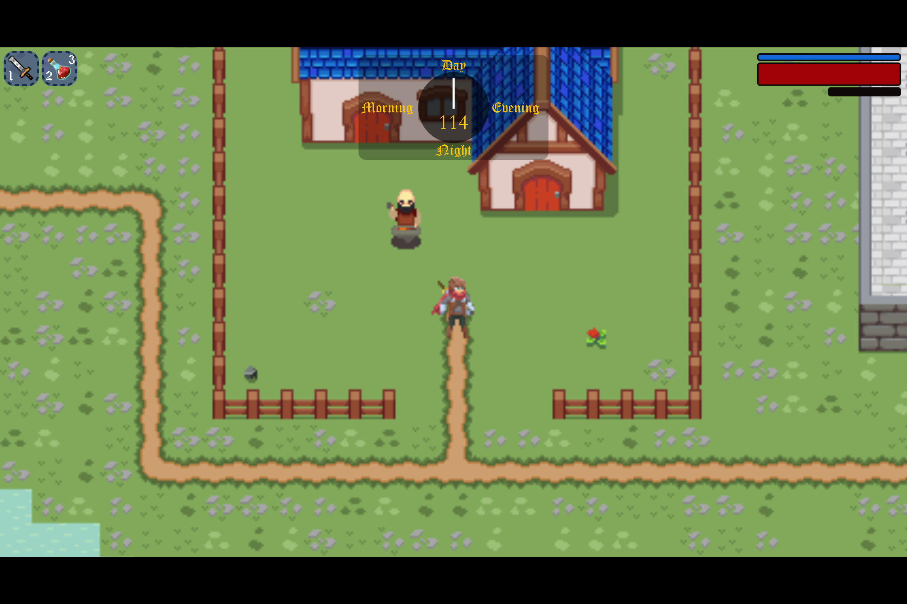
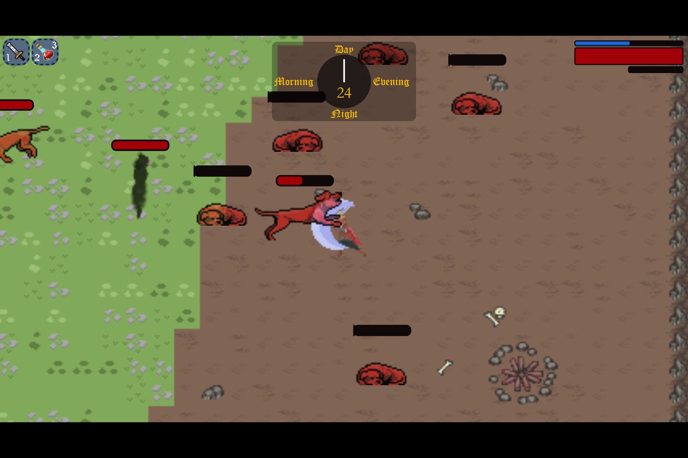
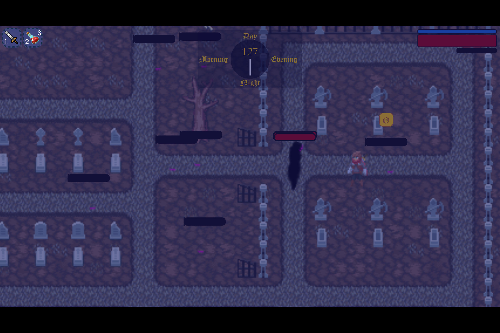
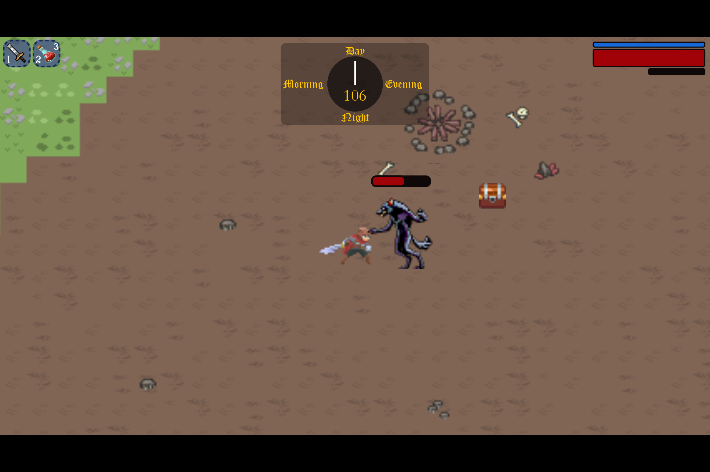
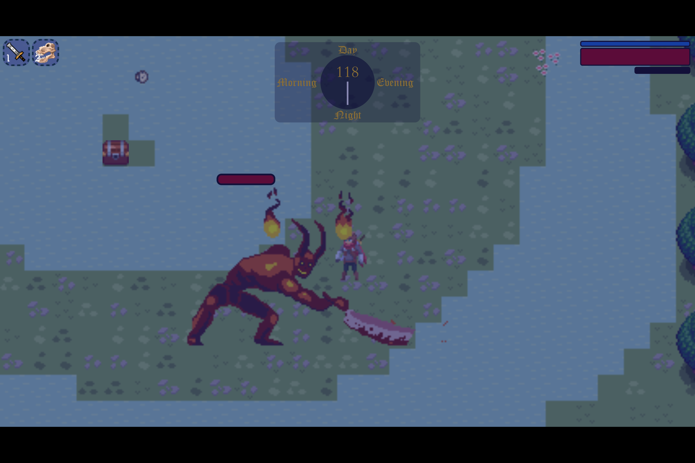
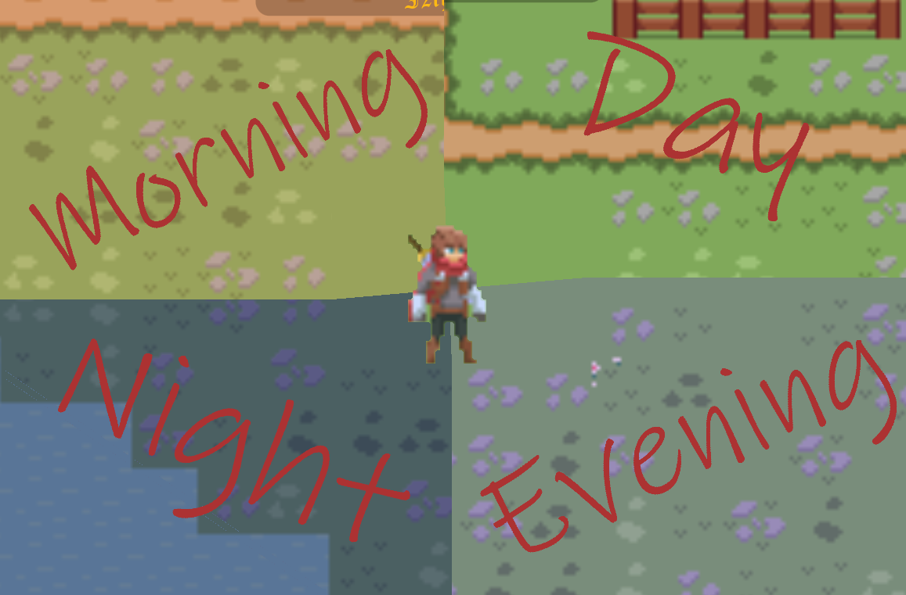
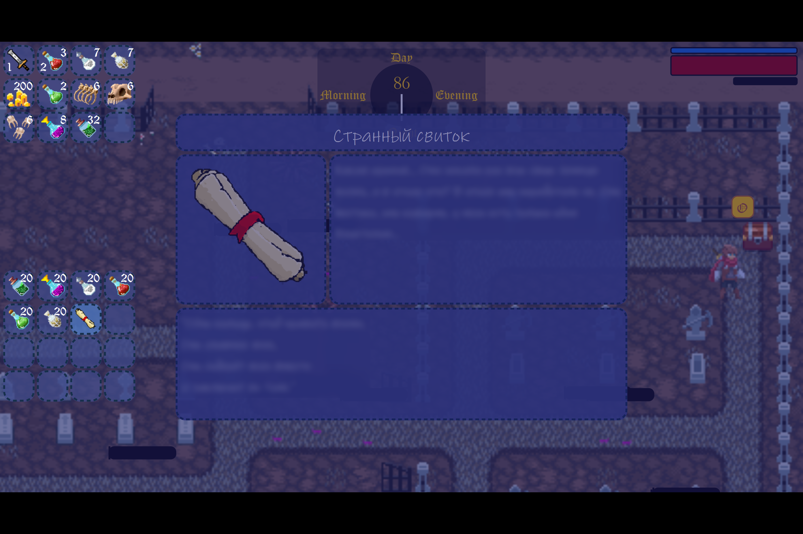
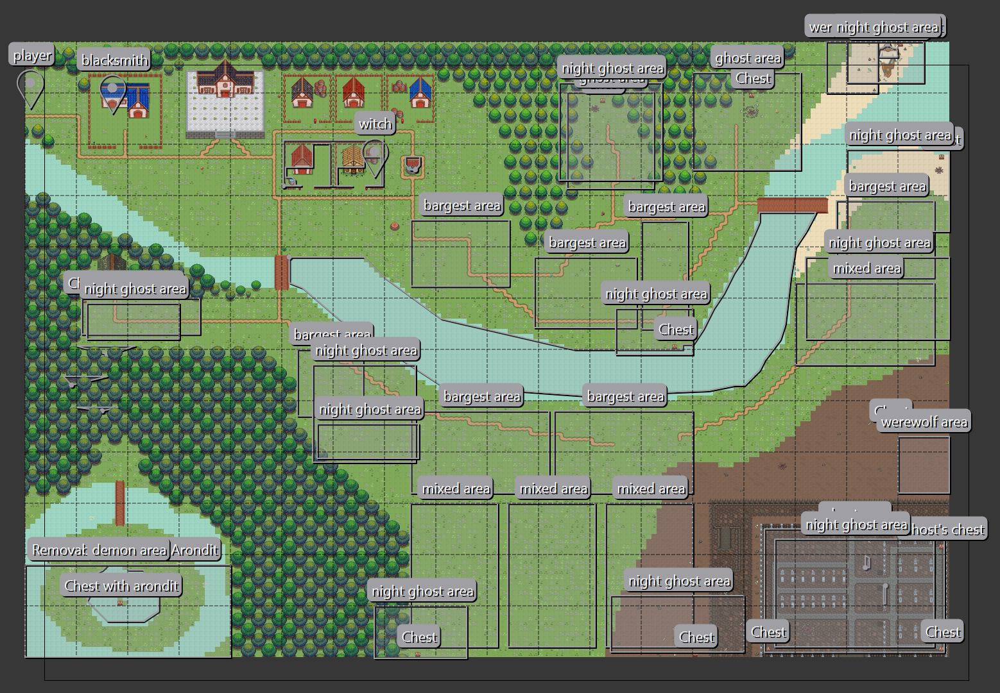
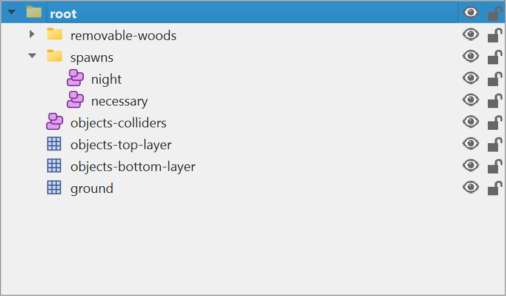

# 🎮 JRPG



## 📑 Содержание

* [📝 Описание](#-описание)
    * [✨ Особенности](#-особенности)
    * [🎮 Управление](#-управление)
    * [🛠️ Технологии](#️-технологии)
    * [💻 Системные требования](#-системные-требования)
    * [📸 Галерея](#-галерея)
* [📥 Установка, разработка и запуск игры](#-установка-разработка-и-запуск-игры)
    * [📁 Структура проекта игры](#-структура-проекта-игры)
    * [🐛 Отладка](#-отладка)
    * [⚙️ Конфигурация](#️-конфигурация)
* [🗺️ Tiled Map Editor](#️-tiled-map-editor)
    * [📁 Структура проекта карты](#-структура-проекта-карты)
    * [🎨 Тайлсеты](#-тайлсеты)
    * [🔑 Основные возможности Tiled в проекте:](#-основные-возможности-tiled-в-проекте)
    * [📸 Галерея редактора](#-галерея-редактора)
    * [📥 Установка Tiled](#-установка-tiled)
    * [🔗 Полезные ссылки](#-полезные-ссылки)


## 📝 Описание

JRPG - она же Java Role Play Game - это 2D ролевая игра, разработанная на Java с использованием FXGL (JavaFX Game Library). Игра представляет собой приключенческий RPG с элементами исследования, боевой системой, инвентарем и динамическим циклом дня и ночи.

### ✨ Особенности

- ⚔️ Боевая система
  - 🎯 Атаки влево/вправо
  - 🏃 Система уклонения
  - 👾 Разнообразные враги:
    - 🐺 Баргест
    - 👻 Призрак
    - 🐺 Оборотень
    - 😈 И другие, которых игрок сможет найти сам :)
  - 🤖 Компоненты ИИ для врагов

- 🎒 Система инвентаря
  - 👤 Инвентарь игрока
  - 🏪 Внешние инвентари (торговцы, сундуки)
  - 🔄 Перемещение предметов между инвентарями
  - 📦 Система ячеек с поддержкой:
    - ✨ Выбора предметов
    - 🔄 Перемещения предметов
    - 🎯 Применения предметов
    - 👀 Просмотра информации о предметах

- 🌓 Динамический цикл дня и ночи
  - 🌅 Утро - 30 секунд
  - ☀️ День - 120 секунд
  - 🌆 Вечер - 30 секунд
  - 🌙 Ночь - 180 секунд
  - 🎨 Визуальные эффекты для каждого времени суток
  - ⚡ Влияние на игровой процесс

- 🎵 Музыкальная система
  - 🎼 Различные плейлисты для разных ситуаций
  - 🔄 Динамическая смена музыки
  - 🎚️ Управление воспроизведением

- 🎯 Система взаимодействия
  - 🎮 Применение предметов
  - 👀 Осмотр предметов
  - 💰 Торговля
  - 👥 Взаимодействие с NPC

- 🗺️ Игровой мир
  - 📏 Размер карты: 180x120 тайлов
  - 🎯 Размер тайла: 16x16 пикселей
  - 📐 Общая площадь: 2880x1920 пикселей
  - 💥 Система коллизий
  - 🎨 Карта создана в Tiled Map Editor

### 🎮 Управление

- ⬆️⬇️⬅️➡️ WASD - Движение
- ⏩ SPACE - Уклонение
- ⚔️ K/L - Атака (влево/вправо)
- 🎒 I - Инвентарь игрока
- 🏪 O - Открыть внешний инвентарь (торговец, сундуки)
- ✨ E - Выбрать предмет для перемещения в инвентаре
- 🔄 R - Переместить все предметы в другой инвентарь
- 📦 G - Переместить 1 предмет в другой инвентарь
- 🎯 F - Применить предмет
- 👀 V - Осмотреть предмет
- 🔄 Q - Переключение между инвентарями
- ❓ H - Показать/скрыть помощь

### 🛠️ Технологии

- ☕ Java 17
- 🎮 FXGL (FX Game Library)
- 🖥️ JavaFX
- 📦 Maven

### 💻 Системные требования

- ☕ Java 17 или выше
- 💾 4GB RAM
- 💿 2GB свободного места

### 📸 Галерея

<details>
<summary>🎮 Игровой процесс</summary>

<figure>
<figcaption>Геймплей:</figcaption>






</figure>
</details>

<details>
<summary>✨ Особенности игры</summary>

<figure>
<figcaption>Цикл дня и ночи:</figcaption>

</figure>

<figure>
<figcaption>Система инвентаря:</figcaption>

</figure>
</details>

## 📥 Установка, разработка и запуск игры

1. ⚙️ Убедитесь, что у вас установлена Java 17 или выше
2. 📥 Клонируйте репозиторий:
```bash
git clone https://github.com/almost-wizard/jrpg.git
cd jrpg
```
3. 🔨 Соберите проект с помощью Maven:
```bash
mvn clean package
```
4. 🚀 Запустите игру:
```bash
java -jar target/jrpg.jar
```

### 📁 Структура проекта игры

```
project/
├── components/           # Компоненты игровых объектов
│   └── character/        # Компоненты персонажей
│       ├── ai/           # ИИ
│       ├── animation/    # Анимации
│       ├── parameters/   # Параметры персонажей
│       └── ui/           # UI компоненты персонажей
├── entity/               # Игровые сущности
│   ├── character/        # Персонажи
│   │   ├── enemy/
│   │   ├── npc/
│   │   └── player/
│   ├── inventory/        # Система инвентаря
│   ├── item/             # Предметы
│   └── trail/            # Эффекты
├── factory/              # Фабрики для создания объектов
├── gameplay/             # Игровая логика
├── physics/              # Физика и коллизии
├── scenes/               # Игровые сцены
├── shared/               # Общие утилиты
└── ui/                   # Пользовательский интерфейс
```

### 🐛 Отладка

В режиме отладки (Config.DEBUG = true) доступны дополнительные возможности:
- 💀 F4 - Убить всех врагов
- 🐺 1 - Создать Баргеста
- 👻 2 - Создать Оборотня
- 😈 3 - Создать Призрака
- 👾 4 - Создать Демона
- ⚰️ 8 - Убить игрока
- 🎵 9 - Следующий трек в плейлисте
- 🧹 0 - Удалить коллайдер до пасхалки

### ⚙️ Конфигурация

Основные настройки игры находятся в `Config.java`:
- 📏 Размеры карты
- ⏱️ Длительность циклов дня и ночи
- ⏳ Задержки между спавном врагов
- 🐛 Режим отладки

## 🗺️ Tiled Map Editor

Tiled Map Editor - это мощный инструмент для создания 2D карт, который использовался для разработки игрового мира. Он предоставляет удобный интерфейс для создания тайловых карт с поддержкой нескольких слоев, объектов и свойств.

Игровой мир создан с использованием Tiled Map Editor. Проект карты находится в директории `jrpg-map/`:

### 📁 Структура проекта карты

```
jrpg-map/
├── Village/                      # Тайлсет деревни
├── tf_ashlands/                  # Тайлсет пустоши
├── Special Sword Animation/      # Анимация меча
├── summer_plains_v1.0_standard/  # Тайлсет летних равнин
├── PixelWoods/                   # Тайлсет леса
├── Obelisk/                      # Тайлсет обелиска
├── MiniMapPack/                  # Пакет мини-карты
├── Cemetery/                     # Тайлсет кладбища
├── Dungeon/                      # Тайлсет подземелья
├── main-map.tiled-session        # Файл сессии Tiled
├── jrpg-map.tmx                  # Файл карты
├── dwarfs-house.png              # Тайлсет дома гномов
├── pixel-art-house.png           # Тайлсет пиксельного дома
├── pirates-tileset.png           # Тайлсет пиратов
├── main-map.tiled-project        # Файл проекта Tiled
└── broken-ship.png               # Тайлсет разбитого корабля
```

### 🎨 Тайлсеты

Игра использует множество различных тайлсетов для создания разнообразного игрового мира:
- Деревня с домами и постройками
- Пустошь с уникальным ландшафтом
- Летние равнины
- Лесные массивы
- Кладбище
- Подземелье
- Различные декоративные элементы (дома, корабли, обелиски)

### 🔑 Основные возможности Tiled в проекте:

- 🎨 Создание многослойных карт
  - Слой тайлов
  - Слой коллизий
  - Слой объектов (NPC, точки спавна, интерактивные объекты)
- 📏 Размер карты: 180x120 тайлов
- 🎯 Размер тайла: 16x16 пикселей
- 🔄 Экспорт в формат TMX (Tile Map XML)
- 🎮 Интеграция с FXGL

### 📸 Галерея редактора

<details>
<summary>🎨 Создание карты</summary>

<figure>
<figcaption>Миникарта игрового мира:</figcaption>

</figure>

<figure>
<figcaption>Работа со слоями:</figcaption>

</figure>
</details>

### 📥 Установка Tiled

1. Скачайте Tiled Map Editor с [официального сайта](https://www.mapeditor.org/)
2. Установите программу
3. Импортируйте тайлсет проекта
4. Начните создавать свою карту!

### 🔗 Полезные ссылки

- [Официальный сайт Tiled](https://www.mapeditor.org/)
- [Документация Tiled](https://doc.mapeditor.org/)
- [Руководство по интеграции с FXGL](https://github.com/AlmasB/FXGL/wiki/Tile-Maps)

---

⭐ Не забудьте поставить звезду репозиторию, если вам понравился проект!
